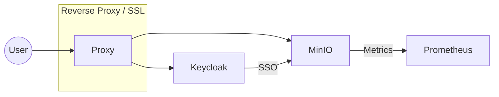

# 🚀 MinIO + Keycloak + Prometheus Docker Setup


This repository provides a modern Docker Compose stack to run **MinIO** (object storage), **Keycloak** (identity and access management), and **Prometheus** (monitoring) together. Perfect for local development, testing, or learning about cloud-native tools.


## 📁 Contents
- `docker-compose.yml`: Defines the services for Keycloak, MinIO, and their configurations.
- `minio-entrypoint.sh`: Custom entrypoint script for MinIO to ensure proper startup.
- `prometheus.yml`: Prometheus configuration to scrape MinIO metrics.


## 🧩 Architecture



## 🛠️ Services

### 🟢 Keycloak
- **Image:** `quay.io/keycloak/keycloak:latest`
- **Ports:** `8080` (HTTP), `8443` (HTTPS)
- **Environment:** Admin credentials, logging, hostname, SSL certs, reverse proxy
- **Volumes:** Persistent data, logs, SSL certificates

### 🔴 MinIO
- **Image:** `minio/minio:latest`
- **Ports:** `9000` (API), `9001` (Console)
- **Environment:** Root credentials, CORS, Prometheus integration, logging, reverse proxy
- **Entrypoint:** Uses `minio-entrypoint.sh` to delay startup and launch MinIO
- **Volumes:** Entrypoint script, data, SSL certificates

### 🟠 Prometheus
- **Config:** Scrapes MinIO metrics from `minio:9000` using the job name `minio-job`


## 🚦 Quick Start

1. **Clone the repository:**
   ```bash
   git clone <this-repo-url>
   cd minio-keycloak
   ```
2. **Set environment variables:**
   - `KEYCLOAK_DOMIAN`, `MINIO_DOMAIN`, `LETSENCRYPT_EMAIL` (in your shell or `.env` file)
3. **Start the stack:**
   ```bash
   docker-compose up -d
   ```
4. **Access services:**
   - Keycloak: `http(s)://<KEYCLOAK_DOMIAN>:8080` or `:8443`
   - MinIO Console: `http(s)://<MINIO_DOMAIN>:9001`
   - Prometheus: (if added as a service)

## 📝 Notes
- Provide valid SSL certificates for Keycloak and MinIO if using HTTPS.
- The `minio-entrypoint.sh` script adds a 10-second delay before starting MinIO to ensure dependencies are ready.
- Prometheus configuration is provided but Prometheus service is not included in the compose file by default.

